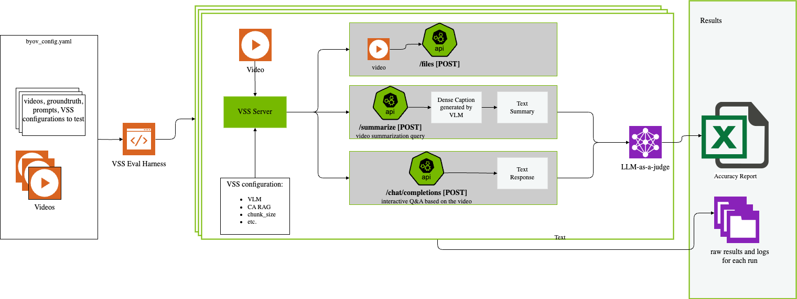
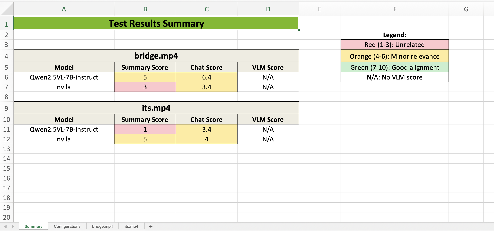
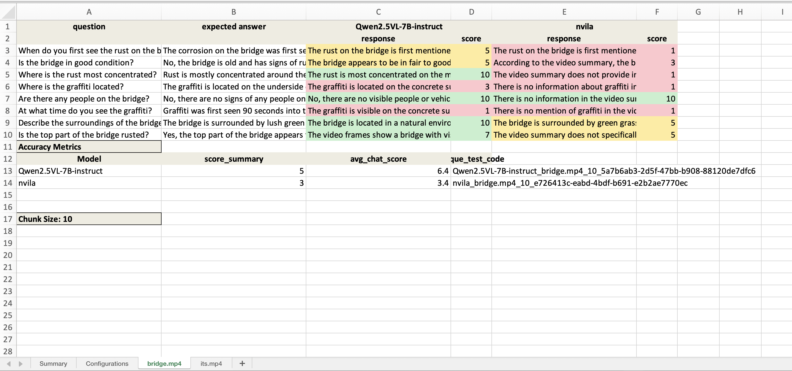
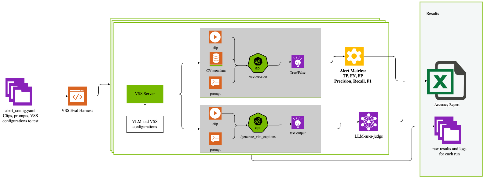
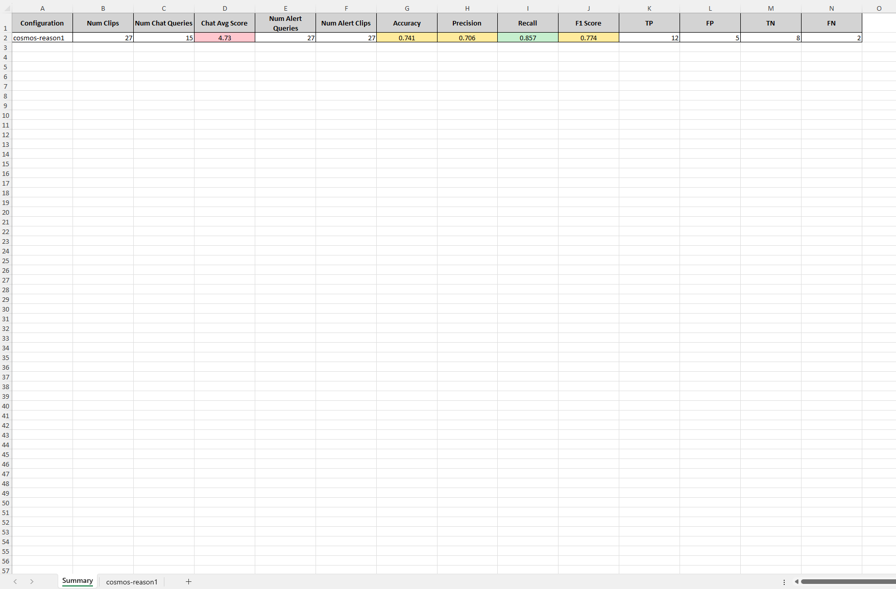
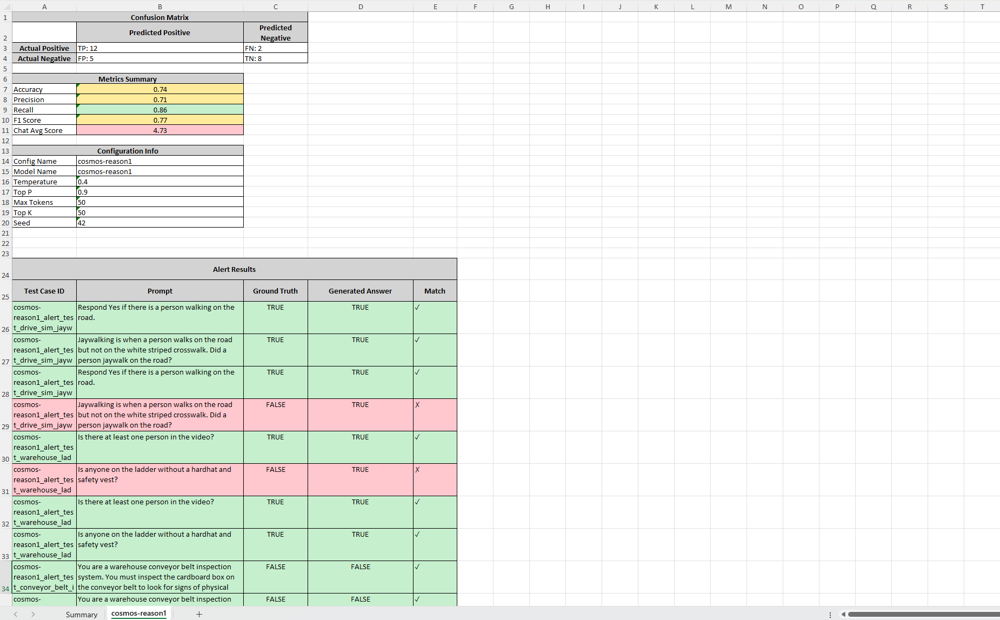

# VSS Accuracy Evaluation

VSS provides an accuracy evaluation harness for users to employ eval-driven development of VSS applications. Users can get started with the sample dataset provided for summary, Q&A, and alerts here. The same workflow can then be followed to bring new custom datasets and evaluate VSS applications built on top of NVIDIA's VSS microservices.

The evaluation harness consists of two main components:

1. **BYOV (Bring Your Own Videos) Evaluation** - Evaluates video summarization and Q&A accuracy by running the VSS pipeline on your videos with corresponding ground truth files for summaries, Q&A, and optionally dense captions. You can select the VLMs you want to test, including custom VLM models, as well as configure other VSS options.

2. **Alerts Evaluation** - Tests the alert review functionality using predefined alert queries and test cases. This harness evaluates how well VLMs can verify alerts and answer questions about specific events in video clips.



> **💡 Tip:** You can run multiple evaluation instances in parallel from different terminals to test different models simultaneously. See [Running Multiple Parallel Evaluations](#running-multiple-parallel-evaluations) for details. 

## Configurable Parameters

| Configuration Option | Description | Where to set it |
|---------------------|-------------|-----------------|
| CA_RAG_CONFIG | Configuration for the CA-RAG model. | ca_rag_config.yaml file, select in the byov_config.yaml file. |
| DISABLE_CV_PIPELINE | Disable the CV pipeline. | byov_config.yaml file, video specific. |
| VLM_DEFAULT_NUM_FRAMES_PER_CHUNK | Number of frames per chunk for the VLM. | byov_config.yaml file. |
| GUARDRAILS_CONFIG | Path to custom guardrails config. | byov_config.yaml file. |
| DISABLE_GUARDRAILS | Enable or disable guardrails. | byov_config.yaml file. |
| VLM model | VLM model to use for the evaluation. | byov_config.yaml file. |
| VLM prompts | Prompts for the video caption, summarization, and summary aggregation. | byov_config.yaml file. |
| LLM judge model | LLM model to use to judge the accuracy of the VSS output. | byov_config.yaml file. |

## Run the Accuracy Evaluation

### Step 1: Setup the VSS Environment (Docker)

* If you have not already, clone the VSS repository, log into the NGC so all containers are accessible, and supply your NGC API Key. Steps can be found here: Deploy Using Docker Compose.

```bash
git clone https://github.com/NVIDIA-AI-Blueprints/video-search-and-summarization.git
```

```bash
docker login nvcr.io
```

```bash
Username: $oauthtoken
Password: <PASTE_API_KEY_HERE>
```

* Set the environment variables as you would for a normal run.

* Create the accuracy evaluation directory in the VSS repo.

```bash
cd src/vss-engine/
mkdir -p logs/accuracy
cd ../../eval  
```

* Edit the environment variables in the .env file.

Set the following major mandatory environment variables. You can leave others to their default values until advanced tuning becomes necessary.

| Environment Variable | Description |
|---------------------|-------------|
| NVIDIA_API_KEY | API key to access NIM endpoints. Should come from build.nvidia.com |
| OPENAI_API_KEY | API key for the remote VLM |
| NGC_API_KEY | API key to pull model from NGC |
| NVIDIA_VISIBLE_DEVICES | Select specific GPUs or all |
| MEDIA_DIRECTORY_PATH | Path to folder with videos |
| MODEL_ROOT_DIR | 5 environments provided: to add volumes that needed to be accessed inside VSS Eval Harness |

### Step 2: Create the Videos Directory

* Ensure that the videos you want to evaluate are all in one directory.
* Set the `MEDIA_DIRECTORY_PATH` environment variable to the full path of your directory containing the videos.

> **Note:** To try out the accuracy evaluation, you can use the sample videos in the `/opt/nvidia/via/streams/` directory inside VSS container.
> Use below setting for the `MEDIA_DIRECTORY_PATH` environment variable:
> 
> ```bash
> export MEDIA_DIRECTORY_PATH=/opt/nvidia/via/streams/
> ```

### Step 3: Create Ground Truth Files for Each Video

The ground truth files must be in JSON format and match the format of the example ground truth files in the `json_gts` directory.

#### Summary Ground Truth

* Edit the `summary_gt.json` file for each video.

> **Note:** An example can be found in the `eval/byov/json_gts/its_ground_truth_summary.json` file.

#### Q&A Ground Truth

* Edit the `qa_gt.json` file for each video. The questions in this file are the questions that will be asked of VSS, and the generated answers will be compared with the ground truth answers you provide in this file.

> **Note:** An example can be found in the `eval/byov/json_gts/its_ground_truth_qa.json` file.

#### Dense Caption Ground Truth

* Edit the `dc_gt.json` file for each video

> **Note:**
> * The dense caption ground truth is optional, but it is recommended to provide dense caption ground truth files to evaluate the accuracy of the captions generated by the VLM. The chunk size for the dense caption ground truth files should be the same as the chunk size set for the videos. There is an example dense caption ground truth file in the `json_gts` directory.
> 
> * An example dense caption ground truth file can be found in the `eval/byov/json_gts/warehouse_82min_ground_truth_dc.json` file.

### Step 4: Select the Configurations and Videos to Evaluate

Edit the `byov_config.yaml` file to specify the videos, ground truth file names, and the VSS configurations you want to use for the evaluation.
This is where you can also specify the VLM, guardrails, and other configurations you want to use for the evaluation.

You can start with one of the sample configuration files below and copy it to `byov_config.yaml`:

| Sample byov_config file | VLMs used |
|-----------------------|-----------|
| [byov_config_sample_2.yaml](byov/byov_config_sample_2.yaml) | Qwen2.5-VL-7B-Instruct, gpt-4o |
| [byov_config_sample_3.yaml](byov/byov_config_sample_3.yaml) | custom |
| [byov_config_sample_4.yaml](byov/byov_config_sample_4.yaml) | CR1 |
| [byov_config_cosmos_reason2.yaml](byov/byov_config_cosmos_reason2.yaml) | CR2 (2 checkpoints), gpt-4o |

> **Note:** See examples of how to set up a vLLM compatible VLM or a custom VLM for the accuracy evaluation:
> * [vLLM compatible VLM](#using-a-vllm-compatible-vlm)
> * [custom VLM](#using-a-custom-vlm)

### Step 5: Create or Upload the `ca_rag_config.yaml` File

Edit or add a `ca_rag_config.yaml` file that specifies the configuration for the CA-RAG.

An example can be found in the `eval/byov/ca_rag_config.yaml` file.

### Step 6: Ensure the Files Are in the Correct Directories

* In the VSS repo, ground truth files should be in a directory called `json_gts` in the eval directory.
* The `ca_rag_config.yaml` and `byov_config.yaml` files should be in the eval directory.

### Step 7: Run the Accuracy Evaluation

From the `eval` directory in the VSS repo, run the following commands:

* Enter the container:
    
```bash
make shell
```

> **Note:** To run multiple parallel evaluations in different terminals (e.g., testing different models simultaneously), you can use isolated Docker Compose projects. See [Running Multiple Parallel Evaluations](#running-multiple-parallel-evaluations) for details.

* [Optional] To try out a sample configuration employing the CR1 model, you can use the following config for `byov`:

```bash
cp eval/byov/byov_config_sample_4.yaml eval/byov/byov_config.yaml
```

* Run the accuracy evaluation:

```bash
PYTHONPATH=/:.:./eval/byov:./eval:./src  python3 -m pytest --noconftest eval/byov/test_byov.py -v -s 2>&1 | tee out.log
```

Your accuracy evaluation results will be saved in the logs/accuracy directory in the container, and in your repository.
A summary of the results will be saved in the `VSS_test_results.xlsx` file.

The sheet will look like this:




<br clear="both"/>

### Step 8: Teardown the VSS Evaluation Harness

To teardown the VSS Evaluation Harness, you can use the following command:

```bash
make down
```

## Run the Alerts Evaluation



### Step 1: Setup the VSS Environment (Docker)
The setup for alert evaluation is similar to BYOV evaluation. Please refer to [Step 1](#step-1-setup-the-vss-environment-docker) for VSS environment setup (Docker, NGC login, environment variables).

You can also use the same container for both BYOV and Alerts evaluation, as long as the media directory and other environment variables are the same.

### Step 2: Set Up Media Directory

Set the MEDIA_DIRECTORY_PATH environment variable to point to the directory containing the clips you would like to test on:

```bash
export MEDIA_DIRECTORY_PATH=/path/to/directory/with/clips
```

You can use the sample video dataset provided in the repo by setting:

```bash
export MEDIA_DIRECTORY_PATH=[PATH_TO_REPO]/eval/alerts/verifyAlerts_clips
```

You may also need to run the following commands to ensure the sample dataset clips stored with LFS are downloaded from the git repo:

```bash
git lfs install
git lfs pull
```

> **Note:** You can use the same media directory for both BYOV and Alerts evaluation and run both test scripts in the same container, just edit the `byov_config.yaml` and `alert_config.yaml` files with the correct relative video paths.

### Step 3: Configure the alerts evaluation

Edit the `alert_config.yaml` file in `eval/alerts` to specify the VSS configurations you want to use for the evaluation. Use the `alert_queries` field for boolean alert verification and `chat_queries` for open-ended questions.

You can start with one of the sample configuration files below and copy it to `alert_config.yaml`:

| Sample alert_config file | VLMs used |
|-----------------------|-----------|
| [alert_config_sample.yaml](alerts/alert_config_sample.yaml) | CR1, gpt-4o |
| [alert_config_cosmos_reason2.yaml](alerts/alert_config_cosmos_reason2.yaml) | CR2 (2 checkpoints), gpt-4o |

> **Note:** See examples of how to set up a vllm compatible VLM or a custom VLM for the accuracy evaluation:
> * [vLLM compatible VLM](#using-a-vllm-compatible-vlm)
> * [custom VLM](#using-a-custom-vlm)

* [Optional] To try out a sample configuration employing the CR1/gpt-4o models, you can use the following config for `alert`:

```bash
cp eval/alerts/alert_config_sample.yaml eval/alerts/alert_config.yaml
```

### Step 4: Run the alert evaluation

As with the BYOV harness, from the `eval` directory in the VSS repo, run the following commands:

* Enter the container (or use the container from the BYOV evaluation if you already have it running):
    
```bash
make shell
```

> **Note:** To run multiple parallel alert evaluations in different terminals (e.g., testing different models simultaneously), you can use isolated Docker Compose projects. See [Running Multiple Parallel Evaluations](#running-multiple-parallel-evaluations) for details.

* Run the alert accuracy evaluation script:

```bash
PYTHONPATH=src:.:./eval/:./eval/alerts python3 eval/alerts/alert_eval.py 2>&1 | tee alert_eval_out.log
```

The output will be saved to `alert_eval_out.log` and a summary of the results will be saved in the `alert_eval_results.xlsx` file.

The sheet will look like this:




<br clear="both"/>

### Step 5: Teardown the VSS Evaluation Harness

To teardown the VSS Evaluation Harness, you can use the following command:

```bash
make down
```

## Using a vLLM Compatible VLM

To use a vLLM compatible VLM, you need to set a few variables in the byov_config.yaml file.

For example to use Qwen2.5-VL-7B-Instruct:

1. Download the model, run vLLM serve, and test the local endpoint. Follow these installation instructions: https://github.com/QwenLM/Qwen2.5-VL#installation-2 

2. Then start a OpenAI API service:

```bash
vllm serve Qwen/Qwen2.5-VL-7B-Instruct --port 38011 --host 0.0.0.0 --dtype bfloat16 --limit-mm-per-prompt image=10,video=1 --served-model-name Qwen2.5-VL-7B-Instruct
```

3. Then set the following variables in the byov_config.yaml file:

```yaml
VLM_Configurations:
  model: openai-compat
  model_path:
  VLM_batch_size:
  frames_per_chunk:
  VIA_VLM_OPENAI_MODEL_DEPLOYMENT_NAME: "Qwen2.5-VL-7B-Instruct"
  VIA_VLM_ENDPOINT: "http://<host>:38011/v1"
```

4. You can now add videos and any other configurations, and then run the accuracy evaluation.

## Using a Custom VLM

Make sure you have created the required files for the custom VLM. See here for an example: Custom Models. Then do the following to set it up for the accuracy evaluation:

1. Set the `MODEL_ROOT_DIR` environment variable to the path to the root directory of the custom VLM.

2. Set the `model` variable to `custom` in the byov_config.yaml file.

3. Set the `model_path` variable to the path to the custom VLM in the byov_config.yaml file.

For example, if you have a custom VLM located at `/home/user/models/custom_vlm`, you would set the following:
* environment variable: `MODEL_ROOT_DIR=/home/user/models`
* byov_config.yaml: `model_path: /home/user/models/custom_vlm`

You can now add videos and any other configurations, and then run the accuracy evaluation.

> **Note:** If you want to use multiple custom VLM models in different configurations that have different root directories, you can set additional `MODEL_ROOT_DIR_1`, `MODEL_ROOT_DIR_2`. environment variables (up to 5) and then set the `model_path` variables to the corresponding model path.

## Generating the Accuracy Evaluation Report from Prior Logs

When running the VSS evaluation, the logs are saved in the logs/accuracy directory and a summary of the results is automatically saved in the VSS_test_results.xlsx file. However you can also generate the report from prior logs.

### Option 1: In the Container

To generate the accuracy evaluation report from logs in the logs/accuracy directory, you can use the following command in the container. This can be helpful if the test failed midway through and you want to generate the report from the logs that were already generated.

```bash
PYTHONPATH=/:.:./eval/byov:./eval:./src python3 eval/byov/test_byov.py excel_only
```

### Option 2: Outside of the Container

To generate the accuracy evaluation report from prior logs outside of the container, you can use the following command from the `eval` directory in the VSS repo.
These logs can be from a previous run of the VSS evaluation, just ensure that the byov_config.yaml file is the same one you used for the evaluation (otherwise ignore the configuration sheet). This command will save the report in the current directory. 

```bash
python3 scripts/get_summary_qa_results_into_xlsx.py <logs_folder_path> <byov_config_file> <output_file_name>
```

## Running Multiple Parallel Evaluations

You can run multiple evaluation instances in parallel from different terminals without conflicts. This is useful for:
- Testing different VLM models simultaneously
- Running BYOV and Alerts evaluations concurrently
- Comparing multiple configurations side-by-side

Each instance runs in a completely isolated environment with its own database instances, volume mounts, and network namespace.

### Method 1: Using Convenience Shortcuts

Open separate terminals and run:

```bash
# Terminal 1
cd eval
make shell1        # Creates project: eval-instance1

# Terminal 2
cd eval
make shell2        # Creates project: eval-instance2

# Terminal 3
cd eval
make shell3        # Creates project: eval-instance3
```

> **💡 Tip:** If you run the same command (e.g., `make shell1`) from multiple terminals, the second terminal will automatically attach to the existing byov container instead of creating a new one. This allows multiple shells into the same environment without conflicts.

### Method 2: Using Custom Project Names

You can use descriptive project names to identify your evaluations:

```bash
# Terminal 1 - Test Qwen model
cd eval
make shell PROJECT_NAME=eval-qwen

# Terminal 2 - Test Cosmos model
cd eval
make shell PROJECT_NAME=eval-cosmos

# Terminal 3 - Test GPT-4o
cd eval
make shell PROJECT_NAME=eval-gpt4o
```

### Attaching Multiple Shells to the Same Environment

If you need multiple terminal sessions in the same evaluation environment (e.g., to monitor logs while running tests), simply run the same command again:

```bash
# Terminal 1 - Start evaluation
cd eval
make shell1

# Terminal 2 - Attach another shell to same environment
cd eval
make shell1    # Automatically attaches to existing container
```

Both terminals will be in the same container, sharing the same filesystem and processes. This is useful for:
- Monitoring logs while tests run
- Checking process status
- Debugging in one terminal while tests run in another

### Monitoring Multiple Instances

```bash
# View all running containers across all projects
make ps

# Check status of a specific project
make status PROJECT_NAME=eval-qwen

# View logs from a specific project
make logs PROJECT_NAME=eval-qwen
```

### Cleanup

```bash
# Clean up a specific project (stops services and removes volumes)
make clean PROJECT_NAME=eval-qwen

# Clean up all eval-related projects (with 5-second warning)
make clean-all
```

### How Docker Services Are Named

Each project creates isolated services with unique names:

**Default project (`eval`):**
- `eval-graph-db-1`
- `eval-milvus-standalone-1`
- `eval-arango-db-1`
- `eval-minio-1`

**Custom project (`eval-qwen`):**
- `eval-qwen-graph-db-1`
- `eval-qwen-milvus-standalone-1`
- `eval-qwen-arango-db-1`
- `eval-qwen-minio-1`

This ensures no conflicts between parallel evaluations.

> **💡 Note:** If you run `make shell` with the same project name from multiple terminals, all terminals will attach to the same byov container (sharing the same shell session). To run truly parallel evaluations, use different project names for each terminal.

### Available Make Commands

Run `make help` to see all available commands:

```bash
make help
```

This displays a comprehensive guide including:
- Basic single-instance commands
- Multi-instance usage patterns
- Monitoring and status commands
- Cleanup options

## Advanced Usage Notes

If you want to mount only the `eval` directory to the container, instead of the entire `vss-engine` directory, you can do the following:

* In the `compose.yaml` file, comment out line 33. If you want to mount the entire vss-engine directory, you can uncomment line 33 and comment out line 34.

