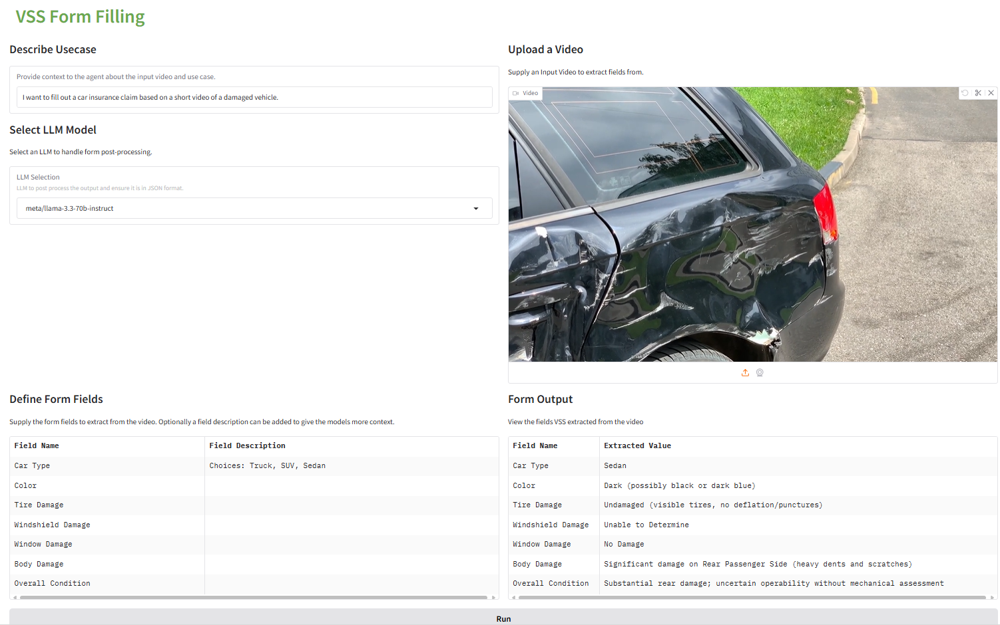

# VSS Automated Form Filling 

## Introduction

This example shows how to use the Video Search and Summarization Agent to automatically file forms based on video content. 

This can be used to automate the process of filing reports for infrastructure inspection, insurance claims and more. For example, given a video of a damaged vehicle and set of fields to fill out, this example will automatically populate the fields based on the video content. This shows how VSS can be used to turn a video into structured data that could then be inserted into a database or more easily integrated with other services. 

## Setup 

Start by cloning this repository and entering this examples directory. 

```
git clone https://github.com/NVIDIA-AI-Blueprints/video-search-and-summarization.git
cd video-search-and-summarization/examples/code_examples/structured_output
```

### Pre-Requisites 

#### VSS Instance 
This demo requires access to a running VSS instance. The demo script for automatic form filing does not have to run on the same machine as VSS but it does need to be on the same network so it is accessible.

If you do not have a VSS instance running, then first follow the [VSS documentation](https://docs.nvidia.com/vss/latest/index.html) to setup a VSS instance then come back and try this demo. 

#### LLM Access 
This demo adds an additional LLM call on top of the VSS API calls to enable automatic form filling and prompt generation. To run this demo you must have access to a LLM with an OpenAI compatible interface. There are three options supported: 

1) NVIDIA_API_KEY from [build.nvidia.com](https://build.nvidia.com) which provides free access to LLMs. 
2) OPENAI_API_KEY from [https://openai.com/index/openai-api/](openai) 
3) Access to any LLM with an OpenAI style REST API interface.

### Make and activate virtual environment (Optional)

It is recommended to setup a virtual environment to install the Python dependencies. Based on your OS, the commands are slightly different. For more resources on creating a virtual environments refer to the [Python documentation](https://docs.python.org/3/tutorial/venv.html). 

**Mac & Linux**
```
python3 -m venv venv 
source venv/bin/activate
```

**Windows**
```
python3 -m venv venv 
.\venv\Scripts\activate.bat
```

### Install dependencies

```
python3 -m pip install -r requirements.txt
```

## Launch Demo

First, export your NVIDIA_API_KEY or OPENAI_API_KEY for LLM access. (If using a self hosted or custom LLM then no need to export anything.)
If your NVIDIA_API_KEY or OPENAI_API_KEY is exported, then it will automatically be used to find LLM models. 

```
export NVIDIA_API_KEY=nv-api-***
```
OR
```
export OPENAI_API_KEY=sk-****
```

Then run the main.py script with the first argument being the path to the VSS instance. Adjust the path to reflect the IP address and backend port of the running VSS instance.

```
python3 main.py http://localhost:8100 
```

If you did not export an LLM API key and are using a self hosted or custom LLM, then you must pass extra LLM parameters when launching main.py to define your api_key, the base_url of the LLM server and the name of the LLM model to be used.

If you are running this example through the [VSS Brev Launchable](https://via.gitlab-master-pages.nvidia.com/via-docs/content/cloud_brev.html), then you can use the following command to launch this example and make use of the local LLM NIM that is deployed locally. 

```
python3 main.py http://localhost:8100 --api_key custom_key --base_url http://localhost:8001/v1
```

## Use Demo UI 

Once the main.py script is launched, a Gradio Web interface will be accessible by default at http://localhost:7860. 
You can go to this link to access the Web UI. 

If you are using the Brev Launchable then use the "Share a Service" feature from the Brev dashboard to make port 7860 accessible and access the UI. 

From the Web UI, you must provide some context to the agent about what type of video and forms you are working with. This will help guide the agent in forming its responses. 

Then provide the form fields along with an optional description and an input video. The form fields should align with your use case and once you submit, the output is a table populated with values associated with each input field. 

If you receive errors in the output fields, its possible the LLM is not able to adhere to producing JSON in the correct format. Try rerunning the example, adjusting the prompt or checking the logs to debug the LLM output. 

## Example Use Case - Insurance Form Filling 




