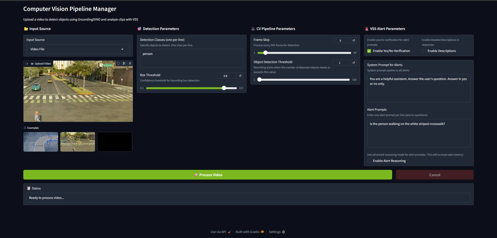
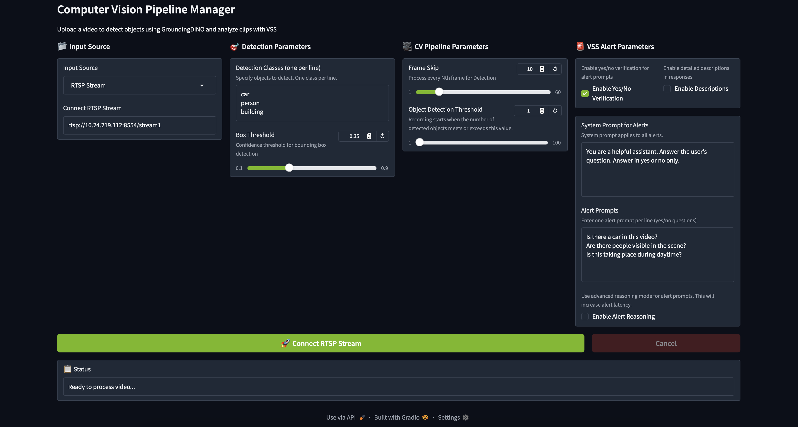
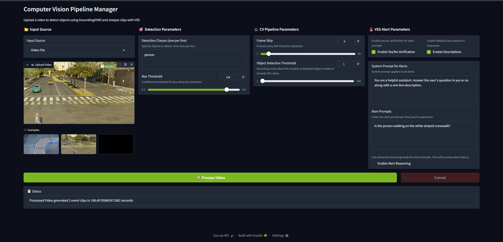

# CV Event Detector

The CV event detector is used to detect events in a video and pass them to VSS to review them
using a VLM.

## Setup Instructions

Clone the current repository and set up the [VSS event reviewer deployment](../../deploy/docker/event_reviewer).

## Launch Instructions

This section lists the instructions for starting the default CV event detector and CV UI containers. For using a custom cv event detector, first refer to the instructions at [Steps for Building nv-cv-event-detector container from source](#steps-for-building-cv-event-detector-docker-image-from-source).

Change the directory using the below command
```sh
cd examples/cv-event-detector
```

```sh
#For X86
ALERT_REVIEW_MEDIA_BASE_DIR=/tmp/alert-media-dir docker compose -f compose.yaml up -d

#For Thor
ALERT_REVIEW_MEDIA_BASE_DIR=/tmp/alert-media-dir docker compose -f compose.yaml -f compose.thor.yaml up -d

# For DGX Spark & GH200 / GB200 SBSA platforms
IS_SBSA=1 ALERT_REVIEW_MEDIA_BASE_DIR=/tmp/alert-media-dir docker compose -f compose.yaml up -d
```

> **NOTE:** Make sure the `ALERT_REVIEW_MEDIA_BASE_DIR` is the same as used for VSS event  deployment.

Once the above containers are started, the CV UI will be available at http://<HOST_IP>:7862, where HOST_IP is the IP address of the machine where app is running. (if you are using the default port)

> **NOTE:** When launching for first time, CV Event Detector may take time (~30 mins) due to model downloads and engine file creation for inference, if it times out during launch increase the retries in compose.yaml.


To stop the deployment, run the following command:
```sh
ALERT_REVIEW_MEDIA_BASE_DIR=/tmp/alert-media-dir docker compose -f compose.yaml down
```

## Customizing the Deployment
If required, user can customize the deployment by setting the environment variables:
```sh
# Set the environment variable for sharing video clips between CV Pipeline and VSS Event Reviewer
export ALERT_REVIEW_MEDIA_BASE_DIR=/tmp/alert-media-dir

# Set the environment variable for the CV Pipeline to configure pre and post event clip generation time
export CLIP_CACHE_PRE_EV_TIME=5000000000 # 5 seconds
export CLIP_CACHE_POST_EV_TIME=2000000000 # 2 seconds

# Set the environment variable for setting the GPU for the Perception and Computer Vision Pipeline
export NVIDIA_VISIBLE_DEVICES=0,1,2,3

# Setting custom model for VLM
export MODEL_ROOT_DIR=/path/to/your/model
export MODEL_PATH=/path/to/your/model

# Set VLM_MODEL environment variable to use cosmos-reason1 prompts for sample videos
export VLM_MODEL=cosmos-reason1
```

## Computer Vision Pipeline Manager UI

Once the application is started, the Computer Vision Pipeline Manager UI will be available at:

http://<host_ip>:7862

Users can add video streams and set alert prompts for events directly in the UI.

The Computer Vision Pipeline Manager provides an intuitive interface for configuring object detection and event reviewer parameters:



---

### Video Upload, RTSP Input and Selection

- **Upload Video**: Select the **Upload Video** selection and upload a video file for processing.
- **Examples**: Use the provided example videos in the **Examples** section to quickly test the system.
- **RTSP Input**: Select the **RTSP Input** selection and set RTSP stream for processing.

---



### Detection Parameters Configuration

- **Detection Classes**: Specify objects to detect using text prompts (one per line). For example:
  - `carboard box` → detect cardboard boxes
  - `vehicle . truck .` → detect vehicles and trucks
  - Objects should be separated by dots when specifying multiple classes

- **Box Threshold**: Set the confidence threshold for bounding box detection (range **0.1 to 1.0**).
  - Lower values (e.g., `0.5`) detect more objects but may include false positives
  - Higher values detect fewer objects with higher confidence
  - Default value is typically `0.5`

---

### CV Pipeline Parameters

- **Frame Skip**: Configure how many frames to skip during processing.
  - `1` → process every other frame
  - `2` → process every 2nd frame
  - Higher values improve processing speed but may miss events as the tracker is used to track objects across frames.

- **Object Detection Threshold**: Set the minimum number of objects to be detected for triggering an event.
  - Range: **1 to 100**
  - Higher values require more objects to be detected
  - Adjust based on your accuracy requirements

---

### VSS Alert Parameters

- **Alert review and Enable Description**: Select the checkbox to enable review of alert prompts along with video description.
- **Alert Prompts**: Enter detailed prompts for event that will be processed by the VLM review.
  Example:

  > *"You are a warehouse conveyor belt inspection system. You must inspect the cardboard box on the conveyor belt to look for signs of physical damage. Physical damage includes but is not limited to: 1) Crumpling 2) Tearing 3) Dents 4) Creases 5) Open boxes. The box should be in near perfect condition. Does one of the cardboard boxes in the video show signs of physical damage?"*

  - These prompts guide the VLM in analyzing detected events.
  - Be specific about what constitutes an alert condition.

- **System Prompt for Alerts**: Enter system prompts based on usecase.
- **VSS Host URL**: Configure the connection to the VSS server (default: `http://via-server:8000`).
  User need not change this if using the default VSS server.


---

### Processing

- Click the **Process Video** button to start video analysis with the configured parameters.
- The system will detect objects based on your configuration and send alerts to the VLM for review through the Alert Bridge along with recordings sent to VST.

---


### Status Information

After processing is complete, the **Status** section displays detailed information about the results:

- **Event Detection Results**: Shows the number of event clips generated during processing.
  Example:
  Processed Video generated 4 event clips in 111.385957072626 seconds

  This indicates how many potential events were detected based on your detection criteria.

- **Processing Time**: Displays the total time taken to process the video and perform event .
  - Includes time for object detection, clip generation, and VLM review
  - Processing time depends on video length, detection parameters, and system resources

- **Event Reviewer**: Each detected event is automatically sent to the Perception Pipeline through the Alert Bridge for review using the configured alert prompts.
  - Events along with review status are forwarded to the **Alert Inspector UI** for review.


## Steps for Building cv event detector docker image from source

This section lists the steps for builidng a custom cv-event-detector.
*  Change the directory to cv-event-detector
    ```sh
    cd examples/cv-event-detector
    ```
*  After making any required changes in the source files in the current directory, build the docker image using the below command.
    ```sh
    docker build -t cv-event-detector-custom .
    ```
*  Set the below environment variable before running the docker compose command as mentioned in [Launch Instructions](#launch-instructions)
    ```sh
    export NV_CV_EVENT_DETECTOR_IMAGE=cv-event-detector-custom
    ```


